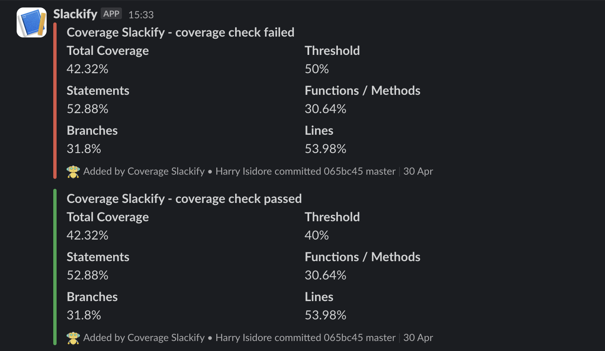

# Coverage Slackify

Welcome to Coverage-Slackify! 🎉

Coverage-Slackify is a handy npm package designed to effortlessly integrate code coverage summaries and build details into your Slack workflow. Whether you're using Istanbul or Jest for testing, this library simplifies the process of notifying your team about the health of your project's test coverage.



## Table of Contents {ignore=true}
<!-- @import "[TOC]" {cmd="toc" depthFrom=2 depthTo=6 orderedList=true} -->

<!-- code_chunk_output -->

1. [🚀 Features](#-features)
2. [🔧 Installation](#-installation)
3. [📋 Prerequisites](#-prerequisites)
4. [🛠 Usage](#-usage)
    1. [Via npm Task](#via-npm-task)
    2. [Defining SLACK_WEBHOOK Environment Variable](#defining-slack_webhook-environment-variable)
5. [🔧 Custom Configuration](#-custom-configuration)
6. [🤝 Contributing](#-contributing)
7. [📄 License](#-license)

<!-- /code_chunk_output -->

---

## 🚀 Features

- Easily incorporate code coverage summaries and build details into your Slack channels.
- Define pass/fail thresholds for project coverage to keep your team informed about the state of your tests.
- Works smoothly with popular CI/CD platforms like Jenkins, Travis CI, and GitHub Actions.
- Handles scenarios where Git is not enabled or the Slack webhook is not provided with ease.
- Customize default settings through `package.json` for a tailored integration.

## 🔧 Installation

You can install Coverage-Slackify via npm or yarn:

```bash
npm install --save-dev coverage-slackify
# or
yarn add -D coverage-slackify
```

## 📋 Prerequisites

Before using Coverage-Slackify, make sure you have the following:

- A Slack webhook URL from your Slack workspace.
- Istanbul or Jest coverage report can be generated for your project.

## 🛠 Usage

### Via npm Task

If you prefer using npm tasks, you can include Coverage-Slackify as part of your testing workflow:

```json
"scripts": {
  "test": "jest --coverage",
  "test-ci": "npm test && coverage-slackify"
}
```

Then, you can run the task in your CI/CD pipeline:

```bash
SLACK_WEBHOOK={$SLACK_WEBHOOK} npm run test-ci
```

### Defining SLACK_WEBHOOK Environment Variable

You can also define the Slack webhook directly as an environment variable:

```json
"scripts": {
  "test": "jest --coverage",
  "test-ci": "npm test && SLACK_WEBHOOK=https://hooks.slack.com/xxxxx coverage-slackify"
}
```

**Note**: Be cautious about exposing your Slack webhook URL in public repositories.

## 🔧 Custom Configuration

You can override default configurations by adding a `coverageSlackify` section in your `package.json`:

```json
"coverageSlackify": {
  "threshold": 80,
  "projectName": "Coverage Slackify",
  "coverageFiles": [
    "coverage/coverage-final.json"
  ]
}
```

---

## 🤝 Contributing

Contributions are welcome! If you have any ideas, enhancements, or bug fixes, feel free to open an issue or create a pull request.

## 📄 License

Coverage-Slackify is licensed under the MIT License. See the [LICENSE](LICENSE) file for details.
